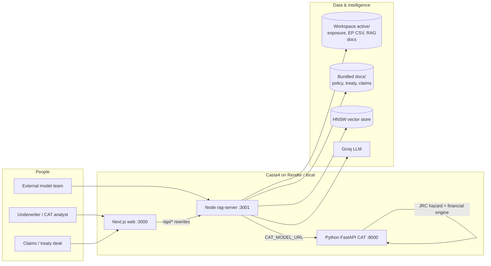
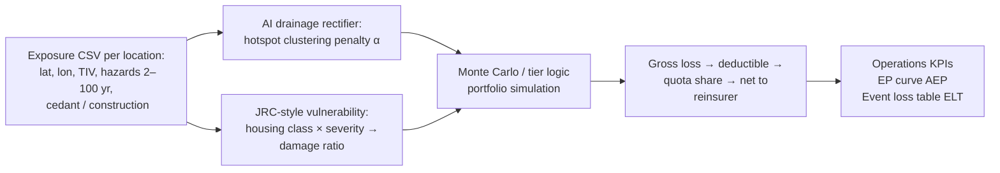
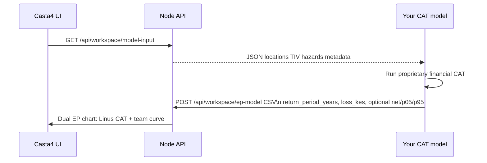

# Casta4 end-to-end workflow (for deck & mentor walkthrough)

Use this instead of a one-line “upload → model → chart” slide. It matches **what is implemented** in the repo (Next.js + Node API + Python CAT + Groq RAG).

---

## 1. System context (who talks to what)

---

## 2. Swimlane: three parallel jobs-to-be-done

```mermaid
flowchart TB
  subgraph lane_portfolio [Portfolio flood CAT]
    P1[Sign in demo workspace]
    P2[Optional: upload exposure CSV +\n region label on Map]
    P3[Workspace saves active exposure;\n manifest sets currency KES/ZMW/XOF]
    P4[Map: pick return period tier 2–100 yr;\n TIV × hazard from CSV]
    P5[Settings: deductible, quota share,\n AI drainage rectifier, hotspot km]
    P6[Operations: dashboard calls CAT /simulate]
    P7[Engine: drainage penalties → baseline vs AI\n portfolio sim → GUL gross net @ 100 yr + ELT]
    P8[EP curve: hazard landscape + CAT AEP lines +\n optional team EP CSV upload]
    P1 --> P2 --> P3 --> P4
    P4 --> P5 --> P6 --> P7 --> P8
  end

  subgraph lane_single [Single-risk underwriting]
    S1[Map: click insured location]
    S2[Location dossier: tier hazards,\n vulnerability damage ratios]
    S3[Underwriting tab: sum insured,\n construction, basement]
    S4[CAT /underwrite-single:\n sample hazard at lat/lon + drainage alpha]
    S5[Damage curves + treaty terms →\n recommendation sheet human decides]
    S1 --> S2 --> S3 --> S4 --> S5
  end

  subgraph lane_claims [Claims & treaty ReAgent]
    C1[Chat or upload PDF/txt into workspace RAG]
    C2[Retrieve chunks: policy, treaty,\n claim form, investigation report]
    C3[Groq answer with citations;\n referral rules e.g. treaty Art. 6]
    C4[Human reviewer: no auto approve/deny]
    C1 --> C2 --> C3 --> C4
  end
```

---

## 3. Financial loss path (what mentors care about)

This is **not** the same as the map “hazard landscape” curve (index of exposure × hazard). **Money** comes from the Python engine.

**Talking point:** Map tiers show **where** flood stress sits on the book; CAT simulation turns that into **KES (or workspace currency)** at return periods and supports **baseline vs AI rectified** comparison on EP curve and Operations.

---

## 4. External model team hook (hackathon integration)

Bundled Nairobi data: `data/team_a_nairobi/`. Other regions: synthetic CSVs under `data/team_a_*` prove **dynamic upload**; CAT GeoTIFF underwriting is **Nairobi-oriented**, but portfolio sim uses **CSV hazard columns** everywhere.

---

## 5. Suggested Canva slide layout (replace shallow workflow)

Use **one slide, four blocks** (icons optional):

| Block | Title | 3 bullets max |
|-------|--------|----------------|
| A | **Ingest** | Demo sign-in · Exposure CSV → workspace · Optional RAG docs for claims |
| B | **Understand risk** | Map tiers & flood book · Location dossier · Vulnerability matrix |
| C | **Quantify loss** | Python CAT simulate · Baseline vs AI rectifier · GUL / gross / net & ELT |
| D | **Decide & explain** | Single-risk underwriting sheet · ReAgent with treaty citations · Human in the loop |

Footer strip: **Next.js → Node (workspace + RAG) → Python CAT → Groq** · Deploy: Render `render.yaml`

---

## 6. Live demo order (5–7 min)

1. **Map** — Nairobi book, switch 10 yr → 100 yr tier; open one high-TIV point.
2. **Location** — Scenarios + underwriting; show recommendation from CAT.
3. **Operations** — 100 yr gross/net when engine healthy.
4. **EP curve** — Baseline vs AI; mention hazard landscape vs financial EP.
5. **Chat** — One treaty referral or coverage question with document cite.
6. **Optional** — Upload Mombasa CSV, show currency/region change (dynamic book).

QR on last slide → production web URL (set in Canva manually).

---

## References

- CSV schemas: `docs/MODEL_IO.md`
- Architecture & run locally: root `README.md`
- CAT API: `nairobi-flood-cat/server.py` (`/simulate`, `/underwrite-single`)
